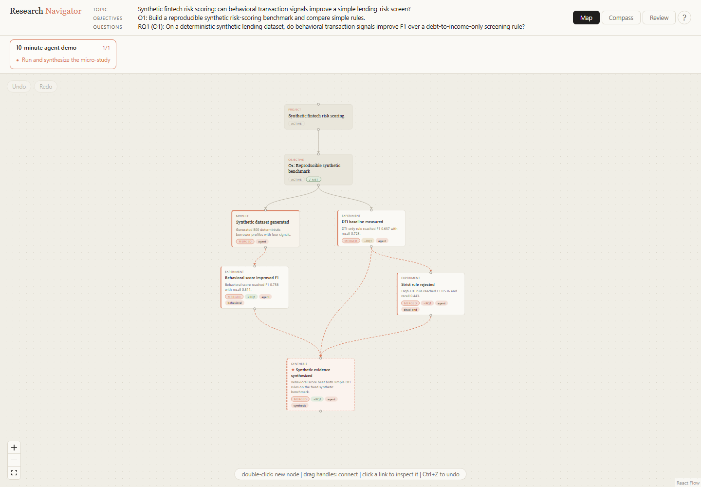

# Research Navigator

A local-first research roadmap tracker that keeps the whole chain — **experiment → objective → research question** — visible while you work, so you never lose the thread between "I ran some code" and "I answered my question."

Your research lives as a **git-style branching graph**: objectives are lanes, experiments are branches, dead ends stay visible (grayed out, never deleted), and finished branches get *merged* with a one-line outcome. A separate **Questions view** is the destination board — each research question has a living answer that fills in from the evidence you link to it. The topic / objectives / questions "compass" is pinned on screen at all times.

**Everything is flat files.** No database, no cloud, no account. `research_data/` is plain Markdown + JSON you can read, edit, grep, and commit anywhere — and it's gitignored by default, so your actual research notes never end up in this repo's git history.

This checkout ships with a demo roadmap (see `research_data/`) purely so the graph isn't empty the first time you open it. It's local-only and untracked; see [Using this as a template](#using-this-as-a-template) for how to start your own project.

## Quick start

Requires Node.js 18+.

```bash
npm install
npm run dev        # API on :3001, app on http://localhost:5173
```

First launch opens a 6-step wizard: topic → objectives → research questions → first tasks → timeline (optional) → review. The questions are deliberately **not** answered by AI — the point is that *you* articulate your plan. The wizard scaffolds one lane per objective, and — if you fill it in — a month-by-month milestone timeline.

Production-ish: `npm run build && npm start` → everything on http://localhost:3001.

## How you use it

- **Double-click the canvas** → new experiment node. Click a node → sidebar with its Markdown lab notes (autosaves, 1s debounce).
- **Drag between node handles** → connect steps.
- **Tags** → in the sidebar, type a tag and hit Enter (e.g. a teammate's name). Tags show as small pills on the node card, and group the "active branches" section in a `research-export` snapshot — the closest thing this app has to task assignment.
- **Mark dead end** → branch grays out with strikethrough. It stays on the map: the record of what you already tried is half the value.
- **Delete node** → a separate, low-key link at the bottom of the sidebar, behind a confirm dialog. This is for genuine mistakes (an empty "untitled" node, a duplicate) — for an abandoned experiment, use "Mark dead end" instead, since that's what keeps the record. There's no keyboard-shortcut delete, on purpose.
- **Merge & summarize** → closes a branch with a short title + outcome, and — this is the point of the app — asks *which research question does this feed, and what does it say about it?* Pick the RQ, mark the finding **positive / negative / mixed** (a negative result is still evidence, not a failure), and write one line. That merged node now shows up as evidence under its RQ.
- **Objectives have a "done when"** → click an objective node and set its exit criterion — the falsifiable line that stops the endless fine-tuning loop ("pipeline runs end-to-end on clean + corrupted sets", not "beats SOTA"). Toggle **Objective met** when it's satisfied.
- **Synthesis nodes** → mark a node as a *synthesis node* (dashed, in the sidebar) when its job is writing analysis that connects several experiments to a question, rather than running code. These are the "stop and think" checkpoints that keep synthesis from being dumped into the final month.
- **Questions view** (top-bar tab) → the destination board. Each RQ shows its status (open / partial / answered), a **living answer** you write and re-write as evidence lands, and the list of experiments feeding it (with their positive/negative/mixed findings). Click any evidence to jump to it on the Map.
- The top bar always shows your compass (topic / objectives / questions). **The app never lets AI rewrite these, or your RQ answers** — only you move the compass and only you write the conclusions.
- If you filled in a timeline, a bar under the top bar shows every month/milestone. Milestones have no manual checkbox — a milestone completes automatically once every node linked to it is merged. Click a milestone to jump to its linked node.

## Data format

```
research_data/
  config.json          { "ollamaUrl": "...", "ollamaModel": "llama3.2" }
  graph.json           nodes + edges (React-Flow-compatible)
  questions.json        research questions + living answers
  timeline.json         months + milestones (optional — absent if you skipped it)
  context/
    layer1_topic.txt
    layer2_objective.txt
    layer3_research_question.txt   (derived from questions.json — kept in sync)
  nodes/<nodeId>.md    free-form lab notes, one per node
```

Node: `{ id, position, data: { title, status: "active"|"merged"|"dead", outcome, anchor?, tags?, kind?: "synthesis", rq?, finding?: "positive"|"negative"|"neutral", contribution?, exitCriteria?, met? } }`.
Edge: `{ id, source, target, data: { kind: "step"|"merge" } }`.
Questions: `{ questions: [{ id: "RQ1", text, obj, status: "open"|"partial"|"answered", answer }] }`. A question's **evidence is derived**, not stored: it's every node whose `data.rq` equals the question's `id`. So linking a node to an RQ (via merge or the sidebar) is the only step — nothing to keep in sync, and deleting a node removes it from the RQ automatically.
Timeline: `{ months: [{ id, title, milestones: [{ id, title, obj: number, nodeIds: string[] }] }] }` — `obj` is the 0-indexed objective (`-1` = general); a milestone is "done" once every node in `nodeIds` is `merged`.

Start a new research project by deleting (or archiving) `research_data/graph.json` — the wizard reappears. Deleting a node from the UI also deletes its `.md` file; nothing else does.

## Use with coding agents

The repo doubles as an agent plugin. `.claude/skills/` ships four skills that any Claude Code session in this repo picks up automatically:

- **research-init** — the agent interviews you (one question at a time, it never plans *for* you) and scaffolds `research_data/` in the exact format above: objectives with exit criteria, questions, first tasks, timeline. An alternative to the UI wizard.
- **research-log** — tell the agent "rolling-memory summary got +12pt over truncation, that's my main RQ1 evidence" and it appends dated notes, branches experiments, marks dead ends, tags nodes, links milestones, and **merges with synthesis** — recording which RQ the result feeds and whether the finding is positive/negative/mixed. Also marks objectives met and updates RQ answers.
- **research-synthesize** — ask it to "answer RQ2" or pull findings together, and it gathers every experiment linked to that question, lays out what supports vs. contradicts it, names the gaps, and drafts a candidate answer *for you to edit and own*. It never decides the answer.
- **research-export** — ask the agent to export/share/summarize and it produces a markdown snapshot led by **where each research question stands**, plus objective done-criteria, evidence-by-question, timeline progress, and active branches grouped by tag. Paste it to a teammate without Claude Code, or save as `ROADMAP_SNAPSHOT.md`.

Because the data layer is plain text with a documented schema, any agent (or script) can read and write your roadmap safely.

### Local action API

Full request and response documentation: [docs/API.md](docs/API.md).
Interactive Swagger UI: `http://localhost:3001/api-docs`.

When the app is running, agents can use semantic local endpoints instead of editing `graph.json` directly:

```text
GET  /api/research/state
POST /api/research/nodes       { title, parentId? }   # omit parentId for a floating node
POST /api/research/links       { source, target, kind?, note? }
POST /api/research/log         { nodeId, note }
POST /api/research/dead-end    { nodeId, reason }
POST /api/research/merge       { nodeId, title, outcome, rq?, finding?, contribution? }
```

To watch an agent use the API, start the app and ask it to use `research-api-demo`, or run `node scripts/research-api-demo.mjs` yourself. The demo intentionally writes test nodes into the local roadmap.

### Fintech micro-study example



This small, deterministic agent-run example asks whether behavioral transaction signals improve a lending-risk screen over a debt-to-income-only rule. It records a baseline, a behavioral branch, a rejected strict-rule branch, and a synthesis that answers the RQ. The resulting synthetic scores were F1 `0.637` (DTI only), `0.758` (behavioral score), and `0.536` (strict high-DTI rule).

Run the reproducible computation with no third-party Python packages:

```bash
python scripts/fintech_micro_research.py
```

It writes its JSON artifact under your ignored `research_data/artifacts/` directory. The screenshot is documentation only; it does not make a clone track demo research data.

## Using this as a template

This repo is meant to be reused: one checkout per research project, each with its own `research_data/`.

- **Starting a new project:** don't just `git clone` this repo for real work — a plain clone keeps `origin` pointed at this same remote, so an accidental `git push` from inside a project lands in the template repo. Instead, either click **Use this template** on GitHub (makes an independent repo), or `git clone <url> my-project && cd my-project && git remote remove origin` before you begin.
- **Starting the roadmap itself:** delete `research_data/` (or just `graph.json`) and run `npm run dev` — the init wizard appears. If you're working with a coding agent instead of the UI, ask it to use the `research-init` skill (see below).
- **Developing the app itself** (new features, UI changes, new skills): work directly in this checkout. It's the one place `research_data/` content doesn't matter — feel free to reset it to the demo data any time.

## Stack

React + Vite, [@xyflow/react](https://reactflow.dev) for the graph, one single-file Express server for file I/O, plain CSS. No database, no state library, no Tailwind. Optional Ollama for summaries.

## License

MIT
